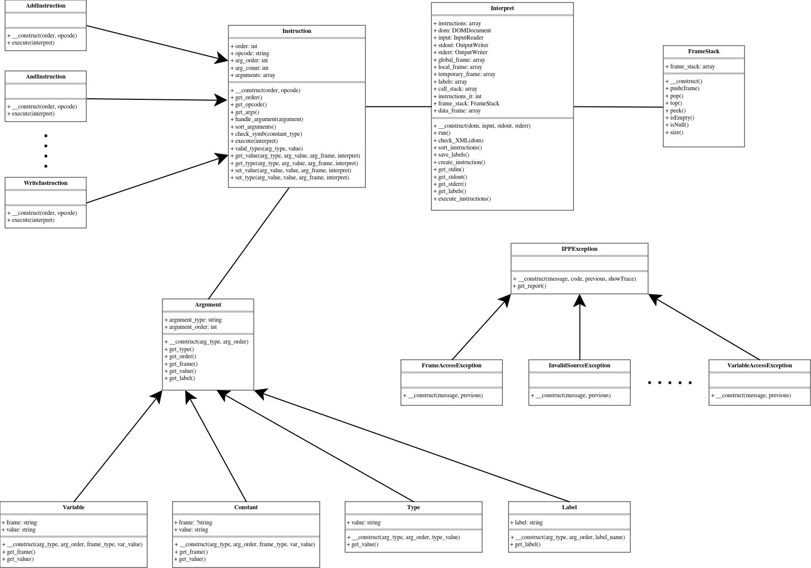

# Documentation of IPP Task 2 Implementation 2023/2024

**Name and Surname:** Marek Čupr  
**Login:** xcuprm01

## Table of Contents
- [Documentation of IPP Task 2 Implementation 2023/2024](#documentation-of-ipp-task-2-implementation-20232024)
  - [Table of Contents](#table-of-contents)
  - [Main Logic](#main-logic)
  - [Implementation](#implementation)
    - [XML](#xml)
    - [Frame](#frame)
    - [Instructions](#instructions)
    - [Arguments](#arguments)
    - [Instrucion pointer / iterator](#instrucion-pointer--iterator)
    - [Exceptions](#exceptions)
    - [UML Diagram](#uml-diagram)
  - [Program flow](#program-flow)

## Main Logic

The program leverages an autoloader provided by the `ipp-core` to load all the classes. Several base classes are utilized for inheritance, and each class is organized into a separate file. The core logic of the program lays within the `Interpret` class, which holds all the instructions and manages the global frame, temporary frame, stack for local frames, call stack, instruction pointer, labels, and other essential components.

## Implementation

### XML
Although `parser` specific errors shouldn't appear in the interpret, systematic error checking is implemented to minimize potential issues originating from the parser. This approach improves the programs' reliability and consistency. 

### Frame
The `global` and `temporary` frames are represented by simple arrays since only one of each can exist at a time. The `FrameStack` class is provided to save `local` frames. Whenever a new local frame is created, it is pushed onto the frame stack and refered to as the current local frame.

### Instructions
Each instruction is validated at the beginning of the code, and its opcode, order, and arguments are saved to a corresponding class that inherits from an abstract `Instruction` class. Instances of all instructions are then stored in an array within the `Interpret` class. This approach incorporates the Factory method pattern, with the `Instruction` class serving as the main factory for other instruction instances. The `Instruction` class contains the most essential getter and setter methods: 
- `get_value`: Retrieves the value of the specified constant or variable from the associated frame.
- `get_type`: Retrieves the type of the specified constant or variable from the associated frame.
- `set_value`: Sets a new value for the specified variable within the associated frame.
- `set_type`: Sets a new type for the specified variable within the associated frame.

### Arguments
Different argument types, such as `var`, `symb`, `type` and `label`, are represented by individual classes. The base class for all the types is the `Argument` class which stores the common attributes like argument type and argument order. The inherited classes then store the argument type specific attributes such as the label name or the frame type.

### Instrucion pointer / iterator
Program jumps and calls are realized using the instruction pointer, which tracks the current instruction being executed and dynamically adjusts based on the programs' context. Instructions `CALL`, `RETURN`, `JUMP`, `JUMPIFEQ` and `JUMPIFNEQ` dynamically manipulate the instruction pointer, redirecting the program flow as needed. Other instructions simply increment the instruction pointer by one upon execution.

### Exceptions
When it comes to error handling, each error code is associated with an exception class that inherits from the `IPPException` provided class. When an error occures, the corresponding exception is thrown, providing a structured way to handle errors within the program instead of using the exit function.

### UML Diagram

## Program flow
1. The **XML** document is parsed and each instruction undergoes validation.
2. The corresponding **instruction** instances are created, along with its' arguments already sorted and validated, and stored in an array. 
3. Instructions are **sorted** based on their unique instruction order number.
4. All **labels** are saved to an array after. The uniqueness of each label is verified to prevent conflicts.
5. Instructions are **executed** sequentially. The instruction pointer dynamically adjusts to control the execution flow. Each instruction implements its own execute method to perform the desired actions.